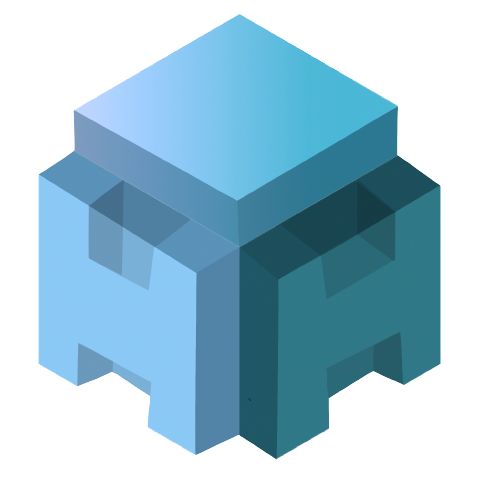

# yush

A simple shell built by Young.

## Documentation

- [Installation](./docs/installation.md)
- [Tutorial](./docs/tutorial.md)
- [Developer Docs](./docs/develop.md)

## yush Commands

- [x] alias
- [x] cd
- [x] echo
- [x] exit
- [x] export
- [x] function
- [x] if
- [x] ls
- [x] pwd
- [x] set

## System support

- [x] Linux
    - [x] Ubuntu 22.04
- [x] MacOS
- [x] Windows [old version](https://github.com/Young-TW/yush/releases/tag/windows-latest)
    - [x] Windows 10
    - [x] Windows 11

## Limitations

yush intentionally omits or does not yet implement several features common in Bash and Zsh.

- **Job control**: `fg`, `bg`, and `jobs` are not supported.
- **Tab completion**: Interactive tab completion is not implemented.
- **Globbing / pathname expansion**: Wildcards (`*`, `?`) are not expanded.
- **Command substitution**: `$()` and backticks ` are not supported.
- **Here-documents**: `<<` syntax is not implemented.
- **Arrays**: Indexed and associative arrays are not supported.

Most of these omissions are deliberate design choices to keep the shell lightweight. Some may be added in future releases.

## Contributing

Please checkout [CONTRIBUTING.md](./CONTRIBUTING.md).
